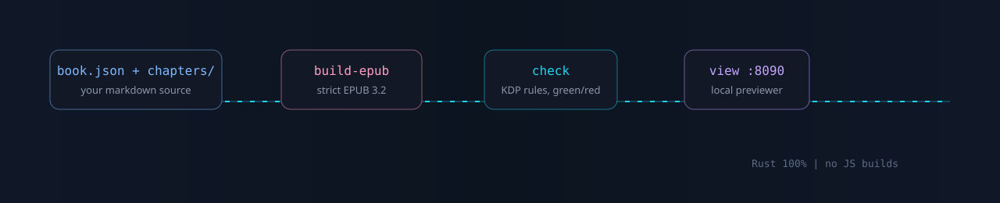

<p align="center">
  
</p>

<p align="center">
  <a href="LICENSE"></a>
  <a href="https://www.rust-lang.org/"></a>
  
  
</p>

<h1 align="center">rebook — a small, strict EPUB 3.2 book tool</h1>

<p align="center">
  <b>From plain markdown to a KDP-ready EPUB</b> in one command, with a local previewer that double-checks every Kindle rule — and it is MIT, so you can <i>build your own book</i> exactly this way.
</p>

<p align="center">
  <a href="#-why-rebook">Why rebook</a> ·
  <a href="#-quick-start">Quick start</a> ·
  <a href="#-commands">Commands</a> ·
  <a href="#-the-sample-book">Sample book</a> ·
  <a href="#-kdp-check">KDP check</a> ·
  <a href="#-layout">Layout</a> ·
  <a href="#-license">License</a>
</p>

---

## Why rebook

rebook is a standalone **Rust** crate (`edition 2021`, `tokio`, `zip`) — no Python, no Node. You write chapters in markdown, it emits a strict EPUB **3.2** file, and a loopback viewer renders it the way a reader would, alongside a KDP-compliance report.

| | |
|---|---|
| **Markdown → EPUB** | `book.json` + `chapters/*.md` → a well-formed EPUB 3.2 (mimetype-first, valid OPF + nav TOC, escaped XHTML) |
| **Local previewer** | `view` → [http://127.0.0.1:8090/](http://127.0.0.1:8090/) — loopback only, multi-book shelf, dark theme, per-chapter pagination |
| **KDP gate** | `/check` flags forbidden constructs, unescaped `& < >`, missing TOC, and required entries — green/red list |
| **Out of the box** | ships a tiny MIT **sample book** under `samples/`, so a fresh clone runs `view` with zero setup |
| **Your book stays local** | the author's real content is gitignored (`book.json`, `chapters/`) — only the tool and the sample are pushed |

The hero / flow tiles below are **SMIL SVG** (no JS). GitHub plays `<animate>` inside an ``; that is why they move.

---

## 🚀 Quick start

<p align="center">
   build-epub -> check -> view :8090." width="100%">
</p>

**Canon shell is MSYS2 bash** on Windows (or any POSIX shell); the viewer binds only to `127.0.0.1`.

### 1. Build the release binary

```bash
cargo build --release
```

> On Windows, **stop the viewer before you rebuild** (`taskkill /F /IM rust_book.exe`). A running server locks the `.exe`, so `cargo build --release` finishes silently with the old binary on disk.

### 2. Preview the sample (no setup)

```bash
cargo run --release -- view --port 8090
```

Open [http://127.0.0.1:8090/](http://127.0.0.1:8090/). If no EPUB exists yet, `view` builds the bundled sample first.

### 3. Make it your book

Drop a `book.json` + `chapters/` into the project root and it takes over automatically:

```bash
cargo run --release -- build-epub   # -> build/rust_book.epub
cargo run --release -- check        # KDP rules report
cargo run --release -- view         # preview at 127.0.0.1:8090
```

---

## 🛠 Commands

| Command | What it does |
|---|---|
| `build-epub` | Build a strict EPUB 3.2 from `book.json` + `chapters/` (or the bundled sample when none is present) |
| `md` | Render the whole book to a single markdown export (stays in sync with the EPUB source) |
| `check` | Validate the built EPUB: mimetype-first, required entries, OPF metadata, spine, nav TOC, escaped XHTML |
| `view` | Local KDP EPUB previewer server → [http://127.0.0.1:8090/](http://127.0.0.1:8090/) |
| `convert` · `kdp` | Deprecated — KDP accepts a valid EPUB directly, no local AZW3/KFX step |

---

## 📖 The sample book

`samples/` is a tiny, deliberately trivial, **MIT-licensed** example (3 short chapters) that exercises every supported markdown form: headings, blockquotes, fenced code, inline `code`, emphasis, and strong. Because it is MIT, it is safe to commit alongside the tool — while your real book under `book.json` / `chapters/` stays private.

To run the sample explicitly instead of a local `book.json`, just remove (or temporarily rename) the root `book.json`.

---

## ✅ KDP check

The previewer’s `/check` (and the `check` command) lists every rule Kindle cares about and marks it **green** or **red**:

- `mimetype` is the **first** entry, itself uncompressed
- required entries (`META-INF/container.xml`, `toc.ncx` / `nav`, cover) are present
- OPF metadata: `dc:title`, `dc:creator`, `dc:language`, `dc:identifier`
- spine has ≥1 item, matches the manifest, TOC lists every chapter
- XHTML is escaped — no stray `&` `<` `>`, no `&amp;`-checked text; no `<script>` / `<iframe>`

When everything is green, the EPUB drops into **Kindle Direct Publishing** as-is.

---

## 🗂 Layout

```
rebook/
├── src/main.rs                 CLI: build-epub, md, check, view
├── src/viewer.rs               multi-book EPUB previewer server + shelf
├── src/lib.rs                  book loading, chapter metadata, word counts
├── src/epub.rs                 strict EPUB 3.2 generator + KDP checker
├── samples/                    MIT sample book (runs out of the box)
├── book.json, chapters/        YOUR book — gitignored, never pushed
├── docs/assets/presentations/  SMIL SVG for the GitHub README
└── LICENSE                     MIT
```

---

## 💡 Notes

- **Rust only.** No Python, no Java. The build is entirely `cargo`; the EPUB is written with the `zip` crate, no external tooling.
- **One commit per change.** This repo keeps a single history line, mirroring the same discipline the rest of the toolchain uses.
- **Loopback only.** `view` binds to `127.0.0.1` so the previewer is never exposed on the network.

---

## ❤️ Support / Donate

rebook is MIT and maintained in the open. If the tool saves you a session, here is how to keep it independent — pick whatever fits.

<p align="center">
  <a href="https://github.com/platinoff/rebook/stargazers"></a>
  <a href="https://github.com/sponsors/platinoff"></a>
</p>

| | |
|---|---|
| ⭐ **Star** | Free, and it actually helps people find the repo |
| 🐙 **[GitHub Sponsors](https://github.com/sponsors/platinoff)** | One-off or monthly · [github.com/sponsors/platinoff](https://github.com/sponsors/platinoff) |
| 💰 **Solana (SOL)** | `GcdgNtdE8NEk3z9sQ5jXv2tqguZjSYqPqNAtjsjPNJx8` |
| 🐛 **Issues** | Bugs and ideas: [github.com/platinoff/rebook/issues](https://github.com/platinoff/rebook/issues) |

---

## License

rebook is [MIT](LICENSE) © 2026 Artem Platinov. The tool and the bundled `samples/` example are free to reuse; your own book under `book.json` / `chapters/` remains your content.